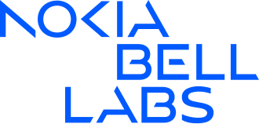

Hi! I am a PhD candidate in the [Purdue University School of ECE](https://engineering.purdue.edu/ECE), working with Professor [Zahra Ghodsi](https://engineering.purdue.edu/ECE/People/Faculty/ptProfile?resource_id=270860&group_id=2571) in the [Trustworthy and Collaborative Learning Systems (TCLS)](https://zahra.page/) lab.

## Research

  
Research illustration (click me)

  

My work involves Security and Privacy, Accelerator Architecture and Machine Learning. Specifically, I make trustworthy ML systems efficient by leveraging the compute capability of GPUs. I aim to bridge the performance goals of hardware accelerators with the security concerns of the ML community, where tasks are distributed across parties and new attack vectors against ML are always discovered.

I have designed GPU accelerated frameworks for privacy-preserving computation, proposed end-to-end frameworks for ML artifact authentication, and achieved significant speedup in ML training with differential privacy. I am also involved in AI/ML security projects by the Open Source Security Foundation (OpenSSF), part of the Linux Foundation.

## Bio
I attended the first two years of undergrad at Taylor's University, Malaysia :malaysia: and completed the rest of my studies at Purdue University, USA :us:, graduating with a BSc. in Computer Engineering in 2020. After a brief experience in the industry, I enrolled into graduate school at Purdue and received a MSc. in ECE in 2024 before continuing on to PhD candidacy. I aspire to join the industry as a researcher.

## Publications

### One RNG to Rule Them All - How Randomness Becomes an Attack Vector in Machine Learning
- Kotekar Annapoorna Prabhu, **Andrew Gan**, Zahra Ghodsi  
- IEEE Conference on Secure and Trustworthy Machine Learning (SaTML)  
- March 2026  
- Paper, Proceedings

### Sentry: Authenticating Machine Learning Artifacts on the Fly
- **Andrew Gan**, Zahra Ghodsi  
- ACM SIGSAC Conference on Computer and Communications Security (CCS)  
- October 2025  
- [Paper](https://andrew-gan.github.io/files/Sentry_paper.pdf), [Slides](https://andrew-gan.github.io/files/Sentry_slides.pdf), [Proceedings](https://doi.org/10.1145/3719027.3765070)

### cuOT: Accelerating Oblivious Transfer on GPUs for Privacy-preserving Computation
- **Andrew Gan**, Setsuna Yuki, Timothy Rogers, Zahra Ghodsi  
- IEEE International Symposium on Hardware Oriented Security and Trust (HOST)  
- May 2025  
- [Paper](https://andrew-gan.github.io/files/cuOT_paper.pdf), [Slides](https://andrew-gan.github.io/files/cuOT_slides.pdf), [Proceedings](https://doi.ieeecomputersociety.org/10.1109/HOST64725.2025.11050054)

## Industrial Experience

- Nokia Bell Labs
- PhD intern  
- June 2026 - Sept 2026
- Stuttgart, Germany :de:

- Amount, Inc.
- Software Test Engineer
- May 2021 - June 2022
- Chicago, USA :us:

## Projects

### GPU-Based Model Integrity SIG
- A [project](https://github.com/ossf/ai-ml-security/issues/41) by the OpenSSF AI/ML Security workgroup, part of the Linux Foundation  
- Establish hardware-agnostic workflow for GPU-based model authentication  
- Model trainers produce cryptographically signed artifacts with accelerated integrity operations

## Teaching

ECE 47920: Privacy-preserving Machine Learning [Spring 2025]  
ECE 36200: Microprocessor Systems and Interfacing [Spring 2023]  
ECE 39595: Object-oriented Programming in C++ [Fall 2022]  

## Awards

Design Automation Conference (DAC) 2025 Young Fellow  
