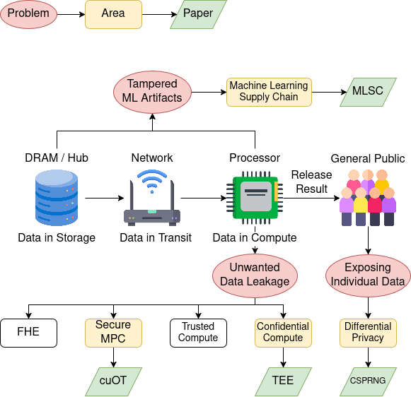

I am a PhD candidate in the [School of Electrical and Computer Engineering](https://engineering.purdue.edu/ECE) at [Purdue University](https://purdue.edu/), under the advice of [Dr. Zahra Ghodsi](https://engineering.purdue.edu/ECE/People/Faculty/ptProfile?resource_id=270860&group_id=2571).

I am a member of TCLS, the Trustworthy and Collaborative Learning Systems lab. We work on integrating ML, MPC and acceleration to build practical and secure intelligent systems. I am open to collaboration regardless of academic department or location of institution.

## Bio
I attended Taylor's University in Malaysia and enrolled into the American Degree Transfer Program (ADP), after which I transferred to Purdue University and graduated with a BSc. in Computer Engineering in 2020. After a brief period in the industry, I went to graduate school at Purdue and received a MSc. in ECE in 2024 before continuing on to PhD candidacy. My intent is to enter the industry as a researcher for a company in the relevant field.

## Research

My work is related to Security and Privacy, Accelerator Architecture and Machine Learning. Check out the research section to learn more! My motivation for this field stems from a desire to bridge the performance concerns of the accelerator community and the security concerns of the cryptographic community. I have built GPU acceleration for privacy-preserving computation, frameworks for authenticating ML artifacts on the GPU and enhancing ML training with differential privacy within an accelerated GPU framework.

## Publication

### Sentry: Authenticating Machine Learning Artifacts on the Fly
- **Andrew Gan**, Zahra Ghodsi
- 2025 ACM SIGSAC Conference on Computer and Communications Security (CCS)
- [Paper](https://andrew-gan.github.io/files/Sentry_paper.pdf), [Slides](https://andrew-gan.github.io/files/Sentry_slides.pdf)

### cuOT: Accelerating Oblivious Transfer on GPUs for Privacy-preserving Computation
- **Andrew Gan**, Setsuna Yuki, Timothy Rogers, Zahra Ghodsi
- 2025 IEEE International Symposium on Hardware Oriented Security and Trust (HOST)
- [Paper](https://andrew-gan.github.io/files/cuOT_paper.pdf), [Slides](https://andrew-gan.github.io/files/cuOT_slides.pdf)

## Awards
- DAC 2025 Young Fellow  
- Fall 2018 Dean's List

## Teaching

### ECE 47920: Privacy-preserving Machine Learning  
- Course Project Advisor  
- Spring 2025  
  
### ECE 36200: Microprocessor Systems and Interfacing 
- Graduate Teaching Assistant  
- Spring 2023  
  
### ECE 39595: Object-oriented Programming in C++
- Graduate Teaching Assistant    
- Fall 2022  
  
### ECE 30862: Object-oriented Programming in C++ and Java  
- Undergraduate Teaching Assistant  
- Fall 2020

## Industry

### Full-time

Amount, Inc. [May 2021 - June 2022]

### Internships

### Fellowships