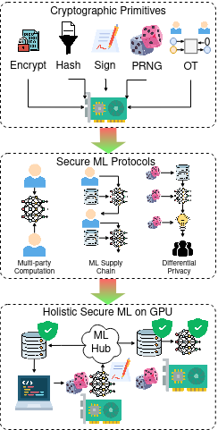

Hi! I am a PhD candidate in the [Purdue University School of ECE](https://engineering.purdue.edu/ECE), working with Professor [Zahra Ghodsi](https://engineering.purdue.edu/ECE/People/Faculty/ptProfile?resource_id=270860&group_id=2571) in the [Trustworthy and Collaborative Learning Systems (TCLS)](https://zahra.page/) lab.

## Research

  
Research illustration

  

My work is strongly tied to Security and Privacy, Accelerator Architecture and Machine Learning. Specifically, I explore ways to make trustworthy ML more efficient by leveraging the compute capability of  GPUs. My aim is to bridge the performance goals of the accelerator community with the security concerns of the cryptographic community in an ever-growing ML landscape, where tasks are increasingly distributed across parties and new attack vectors against ML are always discovered.

I have designed GPU accelerated frameworks for privacy-preserving computation, proposed end-to-end frameworks for ML artifact authentication, and achieved significant speedup in ML training with differential privacy. I am also involved in AI/ML security projects by the Open Source Security Foundation (OpenSSF), part of the Linux Foundation.

## Bio
I transferred from Taylor's University in Malaysia to Purdue University in West Lafayette and graduated with a Bachelors in Computer Engineering in 2020. After working in Chicago as a software test automation engineer, I went to graduate school at Purdue and received a Masters in ECE in 2024 before continuing to PhD. I will become a researcher in the industry and transform research ideas into innovations that benefit many.

## Publications

### One RNG to Rule Them All - How Randomness Becomes an Attack Vector in Machine Learning
\- Kotekar Annapoorna Prabhu, **Andrew Gan**, Zahra Ghodsi  
\- 2026 IEEE Conference on Secure and Trustworthy Machine Learning (SaTML)  
\- Paper, Proceedings

### Sentry: Authenticating Machine Learning Artifacts on the Fly
\- **Andrew Gan**, Zahra Ghodsi  
\- 2025 ACM SIGSAC Conference on Computer and Communications Security (CCS)  
\- [Paper](https://andrew-gan.github.io/files/Sentry_paper.pdf), [Slides](https://andrew-gan.github.io/files/Sentry_slides.pdf), [Proceedings](https://doi.org/10.1145/3719027.3765070)

### cuOT: Accelerating Oblivious Transfer on GPUs for Privacy-preserving Computation
\- **Andrew Gan**, Setsuna Yuki, Timothy Rogers, Zahra Ghodsi  
\- 2025 IEEE International Symposium on Hardware Oriented Security and Trust (HOST)  
\- [Paper](https://andrew-gan.github.io/files/cuOT_paper.pdf), [Slides](https://andrew-gan.github.io/files/cuOT_slides.pdf), [Proceedings](https://doi.ieeecomputersociety.org/10.1109/HOST64725.2025.11050054)

## Projects

### GPU-Based Model Integrity SIG
\- A [project](https://github.com/ossf/ai-ml-security/issues/41) in the AI/ML Security WG, by the OpenSSF, part of the Linux Foundation  
\- Establish hardware-agnostic workflow for GPU-based model authentication  
\- Trainers produce cryptographically signed artifacts with accelerated integrity operations

## Teaching

ECE 47920: Privacy-preserving Machine Learning  
\- Spring 2025  
ECE 36200: Microprocessor Systems and Interfacing  
\- Spring 2023  
ECE 39595: Object-oriented Programming in C++  
\- Fall 2020, Fall 2022  

## Awards
DAC 2025 Young Fellow  
